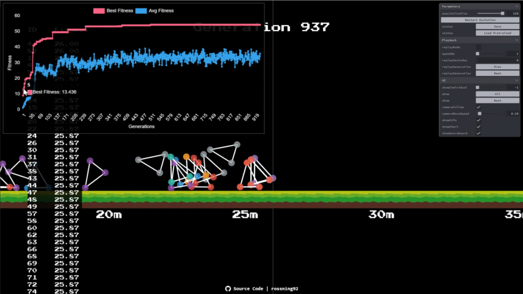

# Genetic Algorithm for Walking Simulation

Online demo: https://rossning92.github.io/genetic-algorithm/

## Build the code

> Make sure you have node 12+ installed: https://nodejs.org/en/download/

- Install all dependencies by `npm i` or `yarn` if you have yarn installed.
- Run demo locally: `npm start`
- Build the whole demo into `/docs` folder: `npm run build`
